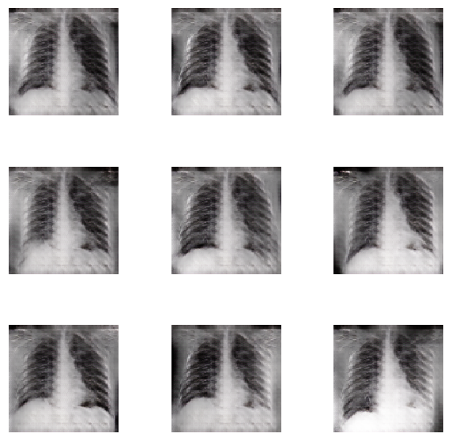
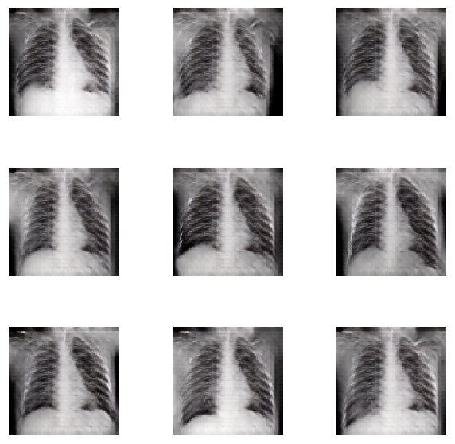

# Generation of Synthetic Chest X-Ray Images and Detection of COVID-19: a Deep Learning based Approach

This is the implementation of the paper Generation of Synthetic Chest X-Ray Images and Detection of COVID-19: a Deep Learning based Approach. 

`loader.py` contains the loading requirements for the dataset.
Required Directory Structure:

```
.
+--Train
|  +--.
|  +--COVID
|  +--NORMAL
+--Test
|  +--.
|  +--COVID
|  +--NORMAL

```

`main.py` contains the discriminator, generator, and the acgan function.

`trainer.py` contains the training methodology for the ACGAN, trained for `1200` epochs.

`utils.py` has the label smoothing function, the print logs function, and the function to generate noise and labels.

`generate.py` loads the trained generator weights and generates the CXR image.

We have added 50 synthetic images in `COVID-19 (Synthetic)`. Remaining synthetic images are available on request, mail yashkarbhari17@gmail.com .

Training dataset was used from from the following:
1) https://github.com/ieee8023/covid-chestxray-dataset
2) https://github.com/agchung/Figure1-COVID-chestxray-dataset
3) https://github.com/agchung/Actualmed-COVID-chestxray-dataset
4) https://www.kaggle.com/tawsifurrahman/covid19-radiography-database

<table>
  <tr>
    <td>Covid-19</td>
     <td>Normal</td>
     
  </tr>
  <tr>
    <td></td>
    <td></td>
  </tr>
 </table>
